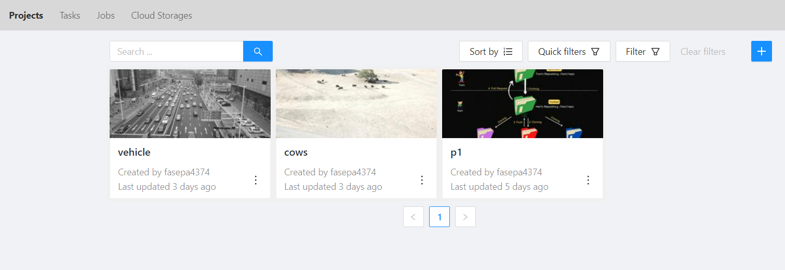
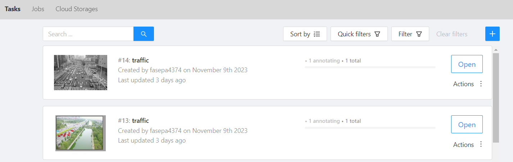
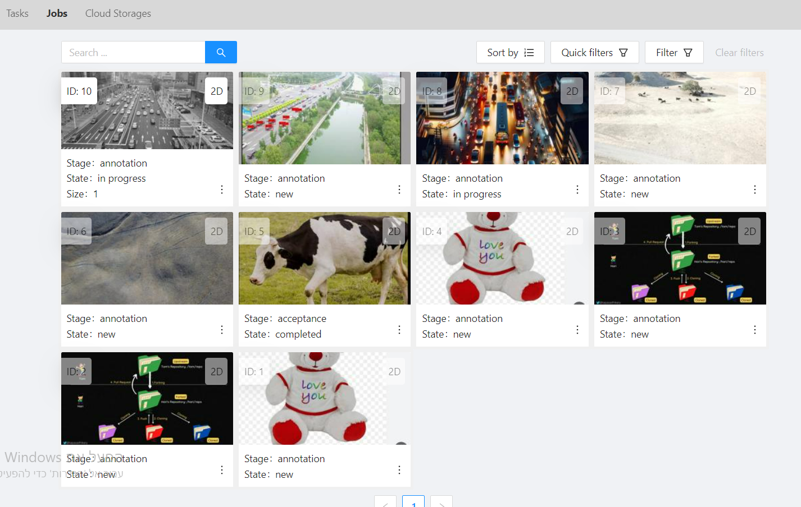
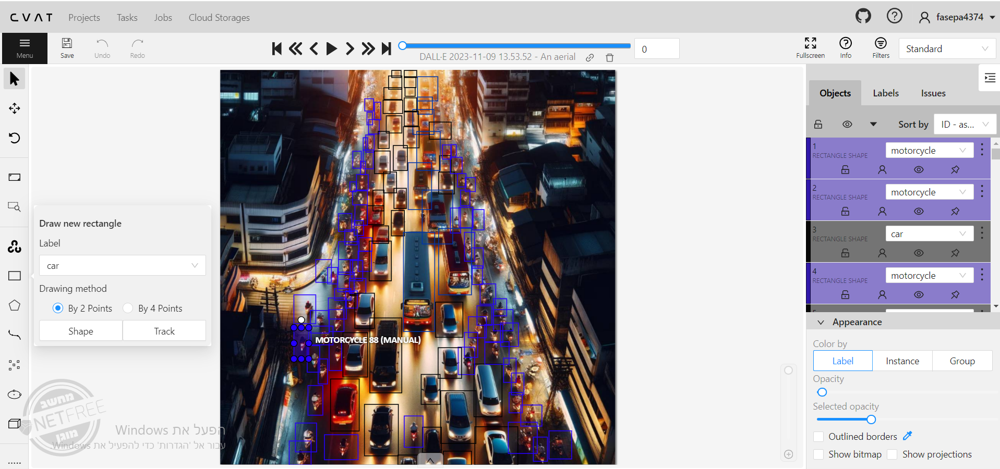

# **CVAT**

### *installation:*

git clone
https://github.com/opencv/cvat

### *Create a project:*

Click the plus button
 
Enter a project name and click Add Label
Insert a label name and color (depending on the object you want to mark)
Several labels can be inserted

### *Create a task*
Click the plus button
 
 Enter the name of the task and belong to the project you created and in the SUBSET field select TRAIN
 and drag the desired image
 
 ### *Create a job*
Click on jobs and select the desired image
 
 On the left side, choose the way you want to mark the object and choose the appropriate tag for the object.
 
 And after finishing the work save the changes
 Click the menu button ->Export job dataset
 and exported in the desired format.

